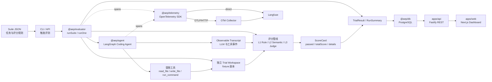
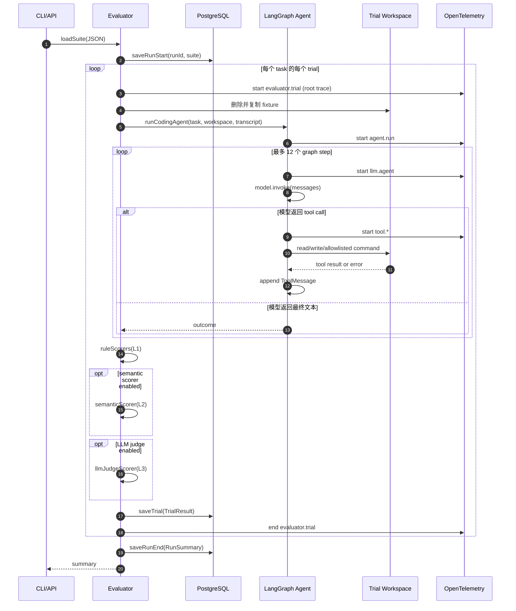
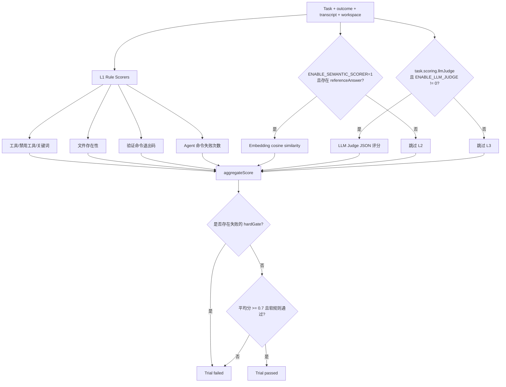
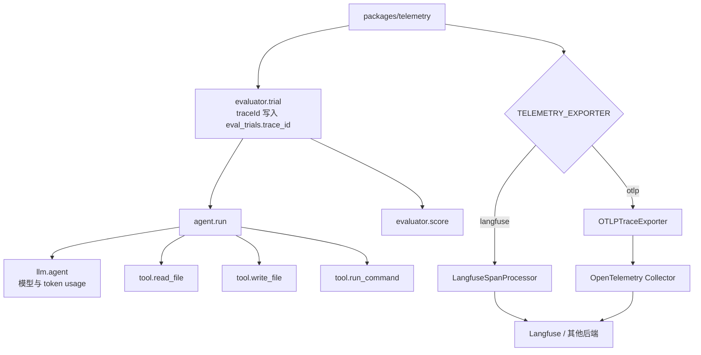

# 项目架构与执行流程

本文档把代码中的模块边界、数据流和运行时控制流集中画出来。图中的模块名称与 workspace package 名称保持一致，便于从图直接跳到实现。

## 1. 总体架构

### 模块职责

| 模块 | 责任 | 不负责什么 |
| --- | --- | --- |
| `packages/shared` | 用 Zod 定义 Suite/Task 和 TypeScript 结果类型 | 不执行 Agent，不连接数据库 |
| `packages/agent` | 在隔离目录中读写文件、执行 allowlist 命令，并记录轨迹 | 不决定任务是否通过 |
| `packages/evaluator` | 创建 Trial、运行 Agent、调用评分器、聚合指标 | 不提供 HTTP 接口 |
| `packages/evaluator/src/scorers` | 实现 L1 规则、L2 Embedding、L3 LLM Judge | 不负责保存结果 |
| `packages/db` | 初始化表结构并持久化 Run/Trial | 不执行评测逻辑 |
| `packages/telemetry` | 初始化 OTel、创建 Span、控制内容采集与 flush | 不改变评分结果 |
| `apps/api` | 暴露健康检查、Run 查询和启动评测的 REST API | 不直接实现评分算法 |
| `apps/web` | 展示 Run、Trial、Transcript、评分和 Langfuse 链接 | 不在浏览器执行 Agent |
| `scripts/run-eval.ts` | CLI 入口和 CI regression gate | 不提供长期 HTTP 服务 |

## 2. 一次 Suite 评测的时序

## 3. 评分与 Hard Gate 流程

`hardGate` 是不可被 L2/L3 高分覆盖的硬约束。Trial 超时或 Agent 抛错时，Evaluator 还会插入一个失败的 `trial_error` hard gate。

## 4. 可观测性分层

默认 `TELEMETRY_CAPTURE_CONTENT=0`，因此 span 仍保留名称、耗时、状态、metadata 和 token usage，但不会上传任务、代码片段或模型内容。打开内容采集前，应先确认脱敏和数据保留策略。

## 5. 安全边界与故障边界

- `agent` 的文件工具通过 `assertInsideWorkspace` 拒绝逃逸 Trial 目录的路径。
- `run_command` 只接受固定前缀 allowlist，并在 Trial workspace 中执行。
- 每个 Trial 先清空并复制 fixture，避免不同 Trial 共享文件修改。
- Agent、验证命令和 Trial 都有超时；子进程超时会被终止，Trial 超时会进入失败评分。
- OTel/Langfuse 是旁路能力，初始化失败不会改变核心评测模型，但 flush/shutdown 会在 CLI/API 退出时执行。
- 当前命令执行仍是本机 `child_process`，不等同于生产级沙箱；公网或不可信输入场景应迁移到 Docker、gVisor 或 Firecracker。
